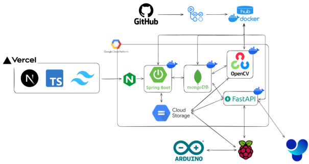

# 🏭 VODA (보다) : Vision Optical Detection, Analysis & Automation

**VODA**는 컨베이어 벨트 위 제품의 결함을 실시간으로 탐지하고 품질 등급을 자동으로 분류하는 AI 스마트 팩토리 솔루션입니다.
하드웨어 제어부터 AI 분석, 실시간 대시보드까지, 생산의 모든 과정을 아우르는 통합 품질 관리 시스템을 만나보세요.

---

## 👨‍💻 팀원 소개 (Our Team)

| 이름 | 소속 | 역할 | 담당 업무 |
| :--- | :--- | :--- | :--- |
| **유민형** | 경기대 | 팀장 (Embedded) | 임베디드 개발, GCS 설정 |
| **김경현** | 경기대 | 개발자 (BE, Embedded) | 임베디드 개발, 결함 서버 개발 |
| **이원빈** | 경기대 | 개발자 (BE) | 서버 인프라 구축 |
| **송수빈** | 경기대 | 개발자 (AI, FE) | AI 모델 개발, 대시보드 작성, PPT |
| **장희원** | 경기대 | 개발자 (AI, FE) | AI 모델 개발, 대시보드 작성, PPT |
| **조호성** | 경기대 | 개발자 (BE, Embedded) | 임베디드 개발, 분류 서버 개발, 하드웨어 구축, 문서담당 |

---

## 🔥Pain Point

-   **느리고 부정확한 육안 검사**: 작업자의 컨디션과 숙련도에 따라 품질 검사의 일관성이 떨어지며, 이는 높은 비용과 시간 소모로 이어집니다.
-   **데이터의 단절과 분산**: 품질 데이터, 생산 이력, 불량 이미지가 여러 곳에 흩어져 있어 문제의 원인을 추적하고 개선점을 찾기 어렵습니다.
-   **대응의 지연**: 실시간으로 품질 현황을 파악할 수 없어, 문제가 발생해도 즉각적인 대응이 어렵고 불량률이 높아집니다.
-   **불안정한 시스템 운영**: 검사 시스템의 어떤 부분(카메라, 서버 등)에 문제가 생겼는지 즉시 알기 어려워, 전체 생산 라인의 신뢰도가 저하됩니다.

## 💡Solution

-   **AI 기반 자동화 검사**: YOLO와 컴퓨터 비전 알고리즘이 24시간 일관된 기준으로 정밀하게 결함을 탐지하고 품질을 분류하여, 사람의 개입을 최소화하고 객관성을 확보합니다.
-   **중앙화된 데이터 플랫폼**: 모든 이미지는 **Google Cloud Storage**에, 분석 데이터는 **MongoDB**에 자동으로 축적됩니다. 이를 통해 데이터 기반의 의사결정과 AI 모델 재학습이 용이해집니다.
-   **실시간 모니터링 대시보드**: Next.js로 구축된 대시보드가 생산량, 불량률, 품질 등급 분포를 실시간으로 시각화하여 보여주므로, 문제 발생 시 즉각적으로 원인을 파악하고 대응할 수 있습니다.
-   **안정적인 운영을 위한 헬스체크**: 시스템의 모든 구성 요소(카메라, AI 서버, 클라우드)를 주기적으로 자동 점검하고, 이상 발생 시 관리자에게 리포트를 전송하여 시스템의 안정성을 극대화합니다.

---

## 🏛️ 프로젝트 아키텍처

| Component | Repository | Description |
| :--- | :--- | :--- |
| 🖥️ **Frontend** | [`VODA_FE`](https://github.com/ZEZEONE-VODA/VODA_FE) | **실시간 품질 모니터링 대시보드.** Next.js 기반으로 생산 현황, 불량률, 데이터 시각화를 제공합니다. |
| ⚙️**Embedded** | [`VODA_EMB`](https://github.com/ZEZEONE-VODA/VODA_EMB) | **물리 제어 게이트웨이.** Raspberry Pi & Arduino가 컨베이어 벨트, 센서, 카메라를 제어하고 데이터를 각 서버에 전송합니다. |
| 🧠 **AI: Defect** | [`VODA_S1_DEFECT`](https://github.com/ZEZEONE-VODA/VODA_S1_DEFECT) | **YOLO 기반 결함 탐지 API.** FastAPI로 구현되었으며, 제품의 결함 유무를 정확하게 판별합니다. |
| 🔬 **Classify** | [`VODA_S2_CLASSIFY`](https://github.com/ZEZEONE-VODA/VODA_S2_CLASSIFY) | **Green Dot 기반 등급 분류 API.** OpenCV와 클러스터링 알고리즘으로 제품을 A/B 등급으로 분류합니다. |
| 🗄️ **Backend** | [`VODA_BE`](https://github.com/ZEZEONE-VODA/VODA_BE) | **중앙 API 서버.** Spring Boot 기반으로 사용자 인증, 데이터 관리 등 핵심 비즈니스 로직을 담당합니다. |

---

## 🛠️ 기술 스택

-   🌐 **Common**: `Google Cloud Storage`, `GitHub Actions`, `Docker`
-   🖥️ **Frontend**: `Next.js`, `TypeScript`, `Tailwind CSS`, `Recharts`, `D3.js`, `Zustand`
-   🗄️ **Backend**: `Java 21`, `Spring Boot`, `MongoDB`, `Spring Security`, `Gradle`
-   🧠 **AI**: `Python`, `FastAPI`, `YOLO`, `OpenCV`, `Scikit-learn`, `TensorFlow`
-   ⚙️ **Embedded**: `Raspberry Pi`, `Arduino`, `Python (pySerial)`, `C++`

---

## 💬 협업 툴 (Collaboration)

-   **GitHub**: 소스 코드 버전 관리, 코드 리뷰(Pull Request), 이슈 트래킹
-   **Notion**: 프로젝트 로드맵, 회의록, 요구사항 정의 등 문서 관리 및 지식 베이스로 활용

---

## ✨ 주요 기능

-   **📸 실시간 결함 탐지 (SNAP 1)**
    -   IR 센서가 제품을 감지하면, Raspberry Pi가 결함 분석용 이미지를 촬영하여 **Defect AI Server**로 전송합니다.
    -   AI 서버는 YOLO 모델로 이미지를 분석하여 불량(`X`) 또는 정상(`GO`) 신호를 즉시 반환합니다.

-   **📊 품질 등급 분류 (SNAP 2)**
    -   두 번째 센서 지점에서 등급 판정용 이미지를 촬영하여 **Classification Server**로 전송합니다.
    -   서버는 Green Dot의 분포와 밀집도를 분석하여 제품을 `A` 또는 `B` 등급으로 분류합니다.

-   **📈 인터랙티브 대시보드**
    -   **생산 현황**: 일/주/월 단위 생산량과 A/B 등급 비율을 실시간으로 추적합니다.
    -   **데이터 시각화**: D3.js의 KDE 히트맵을 통해 Green Dot 분포의 균일도를 한눈에 파악할 수 있습니다.
    -   **이력 조회**: 모든 생산품의 상세한 품질 데이터와 분석 결과를 조회하고 관리합니다.

-   **🛡️ 안정적인 시스템 운영**
    -   **자동화된 CI/CD**: `GitHub Actions`를 통해 코드 변경 시 자동으로 빌드, 테스트, 배포가 이루어집니다.
    -   **시스템 헬스체크**: 컨트롤러가 주기적으로 카메라, 서버, 클라우드 서비스의 상태를 점검하고 GCS에 리포트를 업로드합니다.
    -   **자원 충돌 방지**: `threading.Lock`을 적용하여 여러 프로세스가 하드웨어 자원에 안전하게 접근하도록 보장합니다.

---

## 📬 Contact

**Team ZEZEONE**
